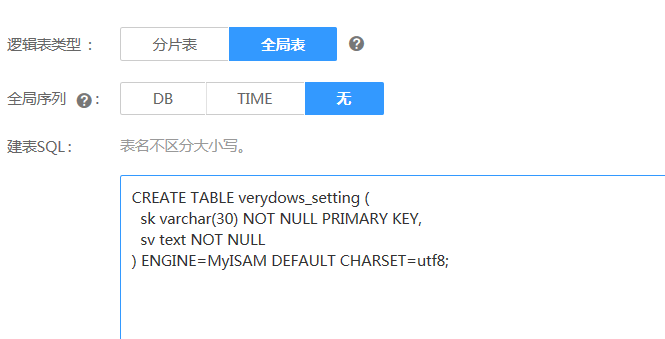
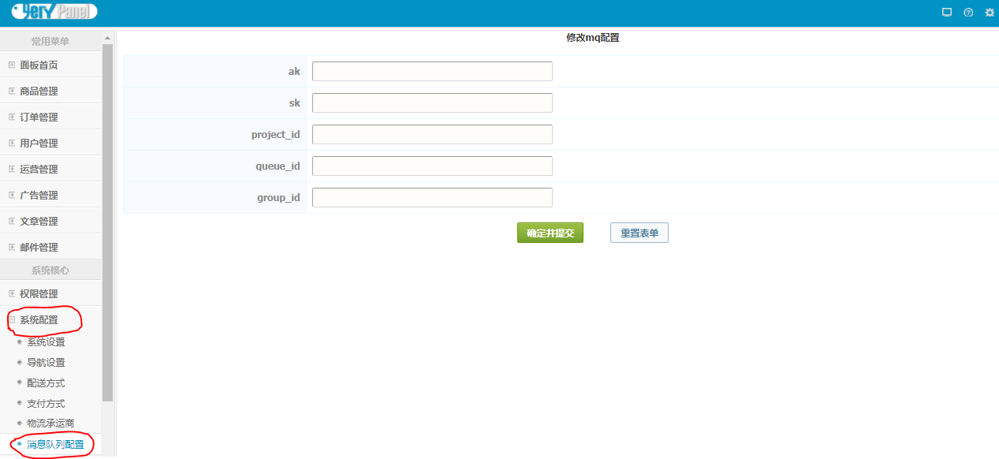
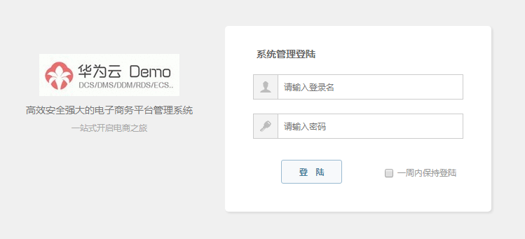
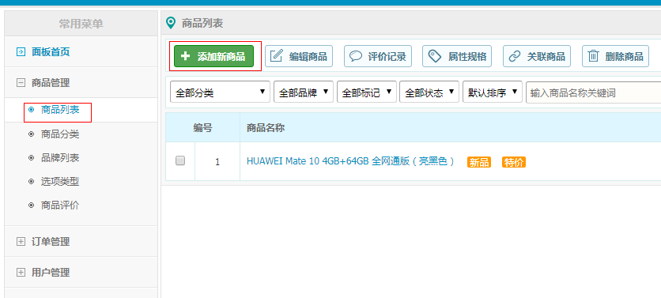

# 华为云60分钟极速搭建电商应用教程

本项目内容为华为云电商Demo教程程序样例，目前支持的服务有：DCS、DMS、DDM、RDS、CCE、ECS、VPN、EVS，如您觉得该项目对您有用，欢迎点击右上方的**Star**按钮，给予支持！

- 华为云电商解决方案：http://www.huaweicloud.com/solution/businesscloud/
- 分布式缓存服务：http://www.huaweicloud.com/product/dcs.html
- 分布式消息服务：http://www.huaweicloud.com/product/dms.html
- 数据库中间件：http://www.huaweicloud.com/product/ddm.html
- Github：https://github.com/huangjingkai
- Gitee：https://gitee.com/huangjingkai
- 商城样例：http://mall.huangjingkai.cn/

**声明：欢迎技术交流。我们不夸大、不装逼、做最纯粹的技术分享，感谢支持！！！**

## 1 华为云商城Demo：资源要求

应当使用华为去优惠券，或者保证账号余额 >100元，否则部分服务可能无法购买。如选择按需付费，完成后请及时删除。

#### 1.1 ECS http://www.huaweicloud.com/product/ecs.html
>* 操作系统：Ubuntu 14.04
>* 规格：1C1G（最低配置）
>* 镜像：Ubuntu14.04 64bit
>* 安全组：要求所有资源在同一安全组内，建议开发全部端口可访问
>* 数量：2台
#### 1.2 DCS http://www.huaweicloud.com/product/dcs.html
>* 规格：2G主备实例（最低配置）
>* 数量：1台
#### 1.3 DMS http://www.huaweicloud.com/product/dms.html
>* 队列类型：普通队列
>* 数量：1台
#### 1.4 DDM http://www.huaweicloud.com/product/ddm.html
>* 规格：4C4G（最低配置）
>* 数量：1台
#### 1.5 RDS http://www.huaweicloud.com/product/rds.html
>* 规格：rds.mysql.c2.medium -- 1 核,2 GB（最低配置）
>* 数量：2台

## 2 华为云商城Demo：商城应用All In One安装
理解架构图：  

#### 2.1 基础环境安装
```
# bash App/ubuntu14.04/build.sh
# cd /var/www/verydows/service
# wget https://lingyang.obs.cn-north-1.myhwclouds.com/jdk-8u151-linux-x64.tar.gz

```
#### 
注意：
1、期间会有MySQL密码的修改，需要记住。获取jdk操作可能耗时较久，可让其在后台下载，在DMS接入步骤查看下载结果。
2、如果遇到Windows换行符格式问题，请转换为Linux格式。 sed -i'' "s/\r//" build.sh
#### 2.2 商城开源版本安装
在浏览器中输入您的网址如: http://localhost/ ，打开后程序将会自动进入 商城应用 的安装程序，之后请按照安装程序的提示完成 商城应用 的安装即可。
>* 前台地址（首次访问）：http://localhost/index.php
>* 后台地址：http://localhost/index.php?m=backend&c=main&a=index

Attention：此时访问页面，如果页面正常，则恭喜你All In One版本已经安装成功！

## 3 华为云商城Demo：商城 + DCS
理解华为云分布式架构图：  


#### 3.1 申请缓存实例

#### 3.2 动静分离，挂载DCS缓存
Step1：为了能够正常访问Cached节点，从第1台ECS弹性IP地址，挂载到第2台上。  
Step2：登录Cached节点，基础环境安装  
```
# bash Cached/ubuntu14.04/build.sh
```
注意：如有换行符问题，请使用 dos2unix 命令转义。
Step3：设置DCS的地址，位于：/etc/nginx/sites-available/redis.conf  
Step4：设置后端APP的地址，位于：/etc/nginx/sites-available/upstream.conf  

#### 3.3 重启Nginx服务
```
# nginx -s reload
```

## 4 华为云商城Demo：商城 + DDM + RDS
难点：需要做数据迁移，方可保障服务可用。
#### 4.1 申请1个DDM实例、2个RDS实例，进行对接
#### 4.2 创建访客信息表
逻辑表步骤可参考华为云帮助中心文档： 创建逻辑表 ，建表SQL语句：
```
CREATE TABLE verydows_visitor_stats (
  sessid char(32) NOT NULL DEFAULT '',
  ip char(15) NOT NULL DEFAULT '0.0.0.0',
  dateline int(10) unsigned NOT NULL DEFAULT '0',
  pv smallint(5) unsigned NOT NULL DEFAULT '1',
  referrer varchar(80) NOT NULL DEFAULT '',
  browser tinyint(2) unsigned NOT NULL DEFAULT '0',
  platform tinyint(2) unsigned NOT NULL DEFAULT '0',
  area char(10) NOT NULL DEFAULT '',
  KEY sessid (sessid) USING BTREE,
  KEY ip (ip),
  KEY dateline (dateline)
) ENGINE=MyISAM DEFAULT CHARSET=utf8;
```
创建示意图：

#### 4.3 创建配置表
建表SQL语句：
```
CREATE TABLE verydows_setting (
  sk varchar(30) NOT NULL PRIMARY KEY,
  sv text NOT NULL
) ENGINE=MyISAM DEFAULT CHARSET=utf8;
```
创建示意图：

#### 4.4 MySQL数据迁出
登录APP节点，对原始数据导出：
```
mysqldump --host 127.0.0.1 -P3306 -uroot -p -t -n -c --databases verydowsdb > /tmp/dumpfile.dump
```

#### 4.5 DDM/RDS数据导入
```
mysql -h 127.0.0.1 -P 5066 -u ddmroot -p -D db_7379
source DB/ubuntu14.04/all.sql
source /tmp/dumpfile.dump
```
#### 4.6 商用应用配置
```
# vi /var/www/verydows/protected/config.php
...
        'MYSQL_HOST' => '127.0.0.1', // DDM IP地址
        'MYSQL_PORT' => '5066', // DDM端口
        'MYSQL_USER' => 'ddmroot', // DDM帐号
        'MYSQL_DB'   => 'db_5601', // DDM逻辑库帐号
        'MYSQL_PASS' => 'XX', // DDM逻辑库密码
...
# service php5-fpm restart;
```

## 5 华为云商城Demo：商城 + DMS
在原有商城系统上新添加积分服务。  
有两种实现方式：第一种是使用RPC实现调用，第二种使用消息队列。  
下订单时的积分服务可以通过DMS异步实现，具有解耦、削峰填谷等优点。  
#### 5.1 DMS配置获取
* 请参考[创建DMS队列](http://support.huaweicloud.com/usermanual-dms/zh-cn_topic_0034678324.html)与[创建消费组](http://support.huaweicloud.com/usermanual-dms/zh-cn_topic_0034678327.html)，记录下*队列ID*和*消费组ID*
* 请参考[获取项目ID](http://support.huaweicloud.com/api-dms/zh-cn_topic_0036212547.html)，记录*项目ID*
* 请参考[创建访问密钥](http://support.huaweicloud.com/api-dms/zh-cn_topic_0036212544.html)完成密钥创建，记录下访问的*AccessKeyId*和*SecretAccessKey*。

#### 5.2 ECS配置和登录
登录第一台ECS  
* 方式1：获取到ECS弹性IP，使用ssh工具远程连接，如Xshell、SecurtCRT、Putty等。
* 方式2：浏览器登录华为云控制台，使用VNC方式远程连接。
```
方式2不方便命令的复制粘贴，且仅提供命令行窗口，不支持linux桌面环境。
```
#### 5.3 启动解耦后的积分系统
##### 5.3.1 启动积分系统
* **step 1: 登录第一台ECS主机。**  
    ```
    # cd /var/www/verydows/service/;
    ```
* **step 2: 查看JDK。**  
查看2.1节中JDK下载的结果，若成功，执行步骤4；若未下载完成，请等待下载完成，再执行步骤4，若下载失败；则执行步骤3，重新下载JDK，再执行步骤4

* **step 3: 下载JDK。**  
    * 方式1：wget http://114.115.148.177/jdk-8u151-linux-x64.tar.gz
    * 方式2：add-apt-repository ppa:webupd8team/java; apt-get update; apt-get install oracle-java8-installer;

* **step 4: 执行build脚本。**  
    ```
    # bash build.sh
    ```
##### 5.3.2 DMS配置
* **step 1:** 登录后台管理系统，点击“系统配置”-> “消息队列配置”。  
管理系统地址：http://<弹性IP>/index.php?m=backend&c=main&a=index。  

* **step 2:** 在输入框中输入对应的配置，具体如下。 
    ```
    ak：5.1节中的 AccessKeyId
    sk：5.1节中的 SecretAccessKey
    project_id：5.1节中记录的 项目ID
    queue_id：5.1节中记录的 队列ID
    group_id：5.1节中记录的 消费组ID
    ```

##### 5.3.3 使用积分功能
说明：积分功能指用户订购了一个商品下单后，会自动增加用户积分，所以需要管理面先在  后台添加商品，然后前端用户才能选购商品。  
* **step 1:**  添加商品  
登录后台管理系统。  
登录地址：http://{第二台ECS EIP}/index.php?m=backend&c=main&a=index  

    ```
    登录IP为部署demo的ECS弹性IP。
    管理员用户名和密码在安装Verydows时指定。
    ```
* **step 2:** 进入商品管理添加商品  

 
* **step 3:** 添加完成商品后，用户就可以在Verydows主页上订购后，订购后就会产生积分。
    ```
    说明：积分入库由消息队列异步实现。
    ```
* **step 4:** 此时，访问公网IP，体验在Verydows的购物。恭喜你，已经成功完成DMS集成！！！

## 6 华为云商城Demo：商城 + ServiceStage (待补充)
## 7 华为云商城Demo：商城 + Anti-DDosService (待补充)
## 8 华为云商城Demo：商城 + WAF (待补充)
## 9 华为云商城Demo：商城 + WebScan (待补充)
## 10 华为云商城Demo：商城 + SIS (待补充)
## 11 华为云商城Demo：商城 + MRS (待补充)
## 12 华为云商城Demo：商城 + OBS (待补充)
## 13 华为云商城Demo：商城 + CDN (待补充)
## 14 华为云商城Demo：商城 + ELB (待补充)
## 15 华为云商城Demo：商城 + AS (待补充)
## 16 华为云商城Demo：商城 + APM (待补充)
## 17 华为云商城Demo：商城 + CCE (待补充)

## 20 华为云商城Demo：商城应用使用指南
#### 20.1 商品添加步骤
登录后台打开商品管理菜单，根据您的经营需要，添加商品分类以及商品品牌。添加完商品分类后，可在商品分类列表页中选中对应的分类，分别对每种商品分类进行属性设置。
>* 后台地址：http://127.0.0.1/index.php?m=backend&c=main&a=index

注意：设置商品后，一定要清除缓存！！否则商品无法即可生效。

#### 20.2 商品选项类型设置
商品选项类型就是用户在浏览商品准备购买或者加入购物车前，对同一个商品有着不同类型、版本等的选择，如“颜色”、“版本”、“大小”、“尺码” 等等。
进入商品列表，找到列表页面顶部的操作按钮中的选项类型，点击进行设置。

未完待续...

## 联系方式
作者：Huangjingkai#foxmail.com
